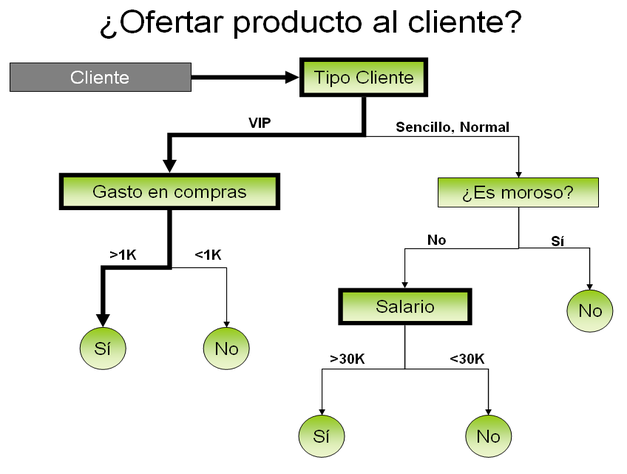

# Trabajo Práctico
:office: Universidad de Huelva (UHU)  
:calendar: Curso 2019-2020  
:mortar_board: Representación del conocimiento 
:octocat: Pablo Cáceres y Marina 

## Introducción
Hemos cogido el código de un id3 y otro código que resuelve el problema de las N-Reinas, para analizarlos y comentar como funciona cada predicado.

El ID3 es algoritmo que genera un árbol de decisión, el cual se encarga de elegir en cada momento el mejor atributo mediante una heurística. Fue desarrollado por J. Ross Quinlan en 1983 y sus siglas significa “Induction Decision Trees”. El algoritmo, mediante un conjunto de entrenamiento, crea el árbol que mejor clasifica al conjunto de entrenamiento. Una vez creado el árbol, es capaz de clasificar nuevos elementos, fijándose en sus atributos, en una de las clases (las clases están en los nodos hoja).

El problema de las N-Reinas es un problema muy conocido en el ámbito de la computación y las matemáticas. Computacionalmente es muy fácil resolverlo, pero matemáticamente incluso se está ofreciendo 1.000.000$ a la persona que encuentre el polinomio que resuelva el problema de las 1000-Reinas.
Este problema consiste en un tablero de N filas y N columnas donde tenemos que colocar a N reinas del ajedrez, sin que ninguna pueda comerse, sabiendo que se pueden desplazar todas las posiciones horizontales y diagonales que deseen.

## ID3

### Metodología
El ID3 es un árbol de decisión, el cual va evaluando cada nodo y mediante una heurística determinada escoge que camino tiene que coger. Finalmente, nos quedamos con el atributo que se encuentra en la última hoja del camino tomado.

  

### Predicados
**examples(?Ns)** --> Es cierto cuando Ns es la lista de nombres N para los que existe una clase C que cumple clasede(+N,+C).

**findall(-Termino, +Objetivo, +ListaResultado)**--> Se hace cierto cuando cada los valores del Termino cumplen el Objetivo y todos juntos unifican con ListaResultado.

**call(+X)**--> Se hace cierto cuando X es cierto.

**X =.. Lista** --> X unifica con una lista que termina con Lista. ej: X = [_,Lista]

**sameclass(+Ns, ?C)** --> Es cierto si todos los nombres de Ns son de la clase C

 **!** --> Descarta todos los puntos de elección creados desde que se inició el predicado en el que aparece.

**filterByClas(+Ns, +C, -Rs)**--> Devuelve todos los nombres de Ns que cumplan class(C).

**proportion(+Ns, +C, +A, ?P)**--> P son las proposiciones de la clase C que está en la lista Ns para los cuales el atributo A es cierto.

**log(+X,-Y)**--> Se hace verdadero si el logaritmo de base 10 de X unifica con Y.

**sum(+[Cabeza|Resto],+Ns,+A,+Acc,-E)** --> En el caso que el resto unifique con [], y P unifique con 0, E unifica con Acc. 
En el caso que E unifique con [] y P sea mayor que 0, E unifica con (Acc +P * log(P)). En el caso que Resto no unifique con [], se procede como los predicados anteriores, pero con la diferencia que se consulta otra vez a sum/5 siendo [Cabeza2|Resto2] = Resto.

**getClases(+Ns,-Cs)**--> Se hace cierto si Cs unifica con una lista de todas las clases que hay en Ns.

**entropy(+Ns, +As, +A, ?E)**--> E unifica con 1.0  y si A no pertenece a As. En caso contrario, unifica con la entropía utilizada.

**minatr(+Ns, +As, ?M)**--> Es cierto si M unifica con el elemento de As con menor entropía en Ns. 

**maxcla(+Ns, ?C)**--> Se hace cierto si C unifica con la clase más representativa de Ns.

**id3(+Ns, +As, +C, ?T)**-->Se hace cierto cuando T unifica con el árbol de decisión donde la lista de nombres es Ns, la lista de atributos es As y la clase C. Cada hoja es una clase.

**tree(?T)**-->  Es cierto si T unifica con el árbol creado con el id3.	

**clasify(+T, +N, ?C)**-->Es cierto si C unifica con la clase del nombre N según el árbol T.

**clasification(+Ns, ?Xs)**--> Xs unifica con una lista de (N,C) tal que N unifica con un elemento de Ns y C es la clase de ese elemento.

### Resultados 

El conjunto de entrenamiento aparece en el documento tal, líneas tal tal:

classof(batman, good).
classof(robin, good).
classof(alfred, good).
classof(penguin, evil).
classof(catwoman, evil).
classof(joker, evil).

Para ejecutar el algoritmo ID3 se han creado nuevos personajes:

name(batgirl).
name(riddler).

Estos personajes tienen atributos, pero no clases.

Para comprobar el funcionamiento del algoritmo, se ha creado el fichero [tests.pl](https://www.google.com/search?client=firefox-b-d&q=id3+prolog). En él se han implementado 2 tests:

**test 1**: Devuelve el ábol que genera el conjunto de entrenamiento.

**test 2**: Clasifica todos los personajes que no tienen clase (no pertenecen al conjunto de entrenamiento).

Los resultados de estos tests son:

?- test(1,R).
R = node(cape, leaf(good), node(mask, leaf(evil), node(ears, leaf(evil), node(smoker, leaf(evil), node(tie, leaf(good), leaf(evil)))))) ;
false.

?- test(2,R).
R = [(riddler, evil),  (batgirl, good)].

## N-Reinas

### Metodología

 Para resolver este problema con prolog, se ha optado coger una lista del 1 al N y la vamos a desordenar. La posición de esa lista nos dice las columnas del tablero, y el contenido de cada posición nos dice la fila donde está la reina en esa columna. Por último, vamos comprobando todas las posibles listas desordenadas hasta encontrar una valida. Este método es la que se utiliza en queens_1/2.

La otra implementación utilizada consiste en colocar una reina, y resolver el problema con     N-1-Reinas, así hasta quedarnos sin reinas que colocar. Este método es la que se utiliza en queens_2/2.

  

### Predicados

**queens_1(+N,-Qs)** --> Qs es la solución del problema y N es el numero de filas, columnas y reinas.

**range(+N1,+N2,-L)**--> Es cierto, si L unifica con una lista que empiece por el elemento N1 y termine con el elemento N2, siendo los demás elementos de la lista números consecutivos que van de N1 a N2.
El caso base es cuando N1 y N2 son el mismo elemento, y L solo contiene ese elemento.
 Los demás casos, se dan cuando N1 es menor que N2, y el primer elemento de L unifica con N1, donde se hace una llamada recursiva con el valor N1+1 y L sin el primer elemento.

**permu(+L1,-L2)**--> Es cierto si L2 es una posible permutación de L1
El caso base se da cuando tanto L1, como L2 son listas vacías.
 Los demás casos se dan cuando L1 y L2, no son listas vacías, donde coge el primer valor de L2 y se llama recursivamente al predicado sin ese valor en L1 ni en L2.

**dell(+E,+L,-L2)**--> Es cierto cuando L2 unifica con el contenido de L menos el elemento E.
 El caso base se da cuando en la cabeza de L unifica con E y el resto de L unifica con L2.
 Los demás casos se dan cuando la cabeza de L no unifica con E, por lo que la cabeza de L pasa a la cabeza de L2 y siendo el resto el resultado de la llamada recursiva.

**test(+Qs)**--> Es cierto si se hace cierto test(Qs,1,[],[])

**test(+L1,+C,+L2,+L3)**--> Se hace cierto cuando cada elemento de L1-C no unifica con ningún elemento de L2 y L1+C no unifica con ningún elemento de L3.
El caso base que utilizaremos, es cuando L1 está vacía.

**memberchk(?E,+L)**--> Es cierto cuando E unifica con algún elemento de la lista L
**\+ A** --> es cierto cuando A no se haga cierta.

**queens_2(+N,-Qs)**--> Qs es la solución del problema. La diferencia con queens_1(+N,-Qs) es que llama a permu_test/4

**permu_test**(+L1,+L2,+C,+L3,+L4)--> Se hace cierto cuando cada elemento de L1-C no unifica con ningún elemento de L2 y L1+C no unifica con ningún elemento de L3 y además
L2 tiene que ser una permutación de L1.
El caso base que utilizaremos, es cuando L1 está vacía.

### Resultados 

Qs = [6,4,1,5,8,2,7,3] 

  

## Biografía

**Algoritmo ID3:** 
https://github.com/ignaciomosca/id3-prolog/blob/master/id3.pl

**N-Reinas (Algoritmo P90):** 
https://www.ic.unicamp.br/~meidanis/courses/mc336/2009s2/prolog/problemas/ 

**Información sobre Prolog:**
https://www.swi-prolog.org/

