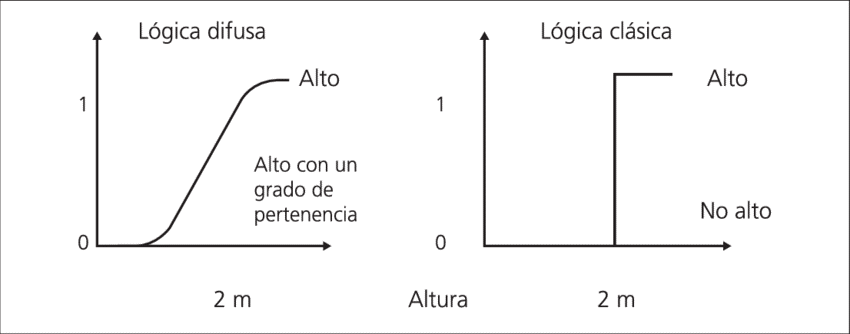

# 1. INTRODUCCIÓN

La comprensión del concepto de Representación del Conocimiento (RC a partir de ahora) es más entendible si es abordada en términos de los cinco posibles roles que desempeña.  Estos roles se resumen de la siguiente forma:
1.	Rol 1: Una RC es un sustituto, reemplazo de la cosa misma, utilizado para permitir a una entidad determinar consecuencias pensando en lugar de actuar.

2.	Rol 2: Una RC es un conjunto de decisiones sobre cómo y qué ver en el mundo. Es importante destacar que una RC no es una estructura de datos.

3.	Rol 3: Una RC es una Teoría Parcial del Razonamiento Inteligente, expresada en términos de 3 componentes:

	a.	La concepción fundamental de la representación del razonamiento inteligente.

	b.	El conjunto de inferencias que la representación establece.
	c.	Conjunto de inferencias que recomienda.

Existen diferentes definiciones para razonamiento inteligente desde distintos campos de estudio, como la matemática (variedad de cálculos formales, típicamente deducibles) o la psicología (comportamiento humano característico), entre otros muchos.

4.	Rol 4: Medio para computación pragmática eficiente, es decir, el entorno computacional en el que se realiza el pensamiento. Organiza la información para facilitar las inferencias.

5.	Rol 5: Medio de expresión humana, una lengua en la que decimos cosas sobre el mundo. 

Además, una buena RC cumple los siguientes puntos:

 •	Es comprensible por los humanos, soporta la modularidad y la jerarquía de clases. Por ejemplo: Los pastores alemanes son perros que, a su vez, son animales.

 •	Tiene consistencia. Un ejemplo de dos interpretaciones: 

	 o	Pablo ha encendido el ordenador.

	 o	El ordenador ha sido encendido por Pablo.

 •	Es eficiente.

 •	Es fácil de modificar y actualizar.

Para terminar de comprender qué es una RC, es necesario definir el término inferencia, pues toda RC lo emplea. Una inferencia es el proceso que lleva de unas premisas a una conclusión, la cual puede ser válida o no. Una oración es válida si y solo sí es verdadera en todos los casos posibles.

# 2. TÉCNICAS DE RC

Existen cinco técnicas para la Representación del Conocimiento:

 •	Representación Lógica

 •	Representación de Red Semántica

 •	Reglas de Producción

 •	Representación de Marcos

 •	Redes neuronales

Estás técnicas están apoyadas en lenguajes y estos constan de dos aspectos básicos:

 •	Sintaxis, que explica cómo es la forma en la que se construyen las oraciones, combinando estructuras más sencillas. Por ejemplo: en la oración _Marina puerta la abre_, se puede decir que es sintácticamente errónea porque sus elementos están mal ordenados.

 •	Semántica, que explica la correspondencia entre los elementos del lenguaje y su significado.

## 2.1 REPRESENTACIÓN LÓGICA

Técnica que permite llegar mediante el razonamiento a una conclusión, basándose en unas premisas dadas.
Este razonamiento puede ser deductivo, donde la conclusión contiene conocimiento que es deducido de forma inmediata de las premisas. Un ejemplo de razonamiento deductivo seria, si todos los humanos son mortales, y Jonny Depp es humano, por lo que podemos deducir que Jonny Depp es mortal.
 Por otra parte, el razonamiento también puede ser inductivo, que es la que se utiliza en esta representación, donde el conocimiento aportado por las premisas no se infiere directamente a la conclusión. Por ejemplo, si un pastor alemán y un bulldog ladran, podemos inferir que un husky siberiano ladra.
Si llegamos a una conclusión por reglas de elementos del mismo tipo, como en el ejemplo anterior, no siempre tiene por qué ser verdad, pero es verdadero con una cierta probabilidad por lo que llamaremos a estos como razonamientos probabilísticos o plausibles.

Dentro de la representación lógica tenemos distintas técnicas lógicas:

•	Lógica clásica, son aquella que una conclusión es verdadera totalmente o falsa totalmente.

•	Lógicas no clásicas (lógica difusa), son aquellas en la que algo es cierto con un grado de probabilidad.

•	Lógica propositiva o lógica de enunciados, las cuales manejan preposiciones completas y podemos unirlas mediante conectores.

•	Lógica de predicados de primer orden, en las cuales manejamos objetos, predicados sobre los objetos, propiedades (dueño de, hijo de), cuantificadores (muchos, pocos, nada) y conectores.

•	Lógica de predicados de orden superior, es aquellos donde podemos hacer inferencias sobre la lógica.

•	Lógica multivaluadas, son aquellas en las que tratamos con varios valores de verdad, introduciendo el valor ½ para las proposiciones cuya verdad está por determinar, cómo las proposiciones futuras.

        

**VENTAJAS**

 •	 Facilidad de implementación

 •	 Similar al comportamiento humano

 •	 Forma rápida y económica de resolver problemas

**DESVENTAJAS**

 •	 Ante problemas que tiene solución mediante un modelo matemático, obtenemos peor resultado.

 •	 Existe muy pocas herramientas de depuración.

 •	 Es poco utilizado en problemas reales.

 •	 Dependiendo del problema, el motor de inferencia puede ser ineficiente. 

## 2.2 REPRESENTACIÓN DE RED SEMÁNTICA

## 2.3 REGLAS DE PRODUCCIÓN

## 2.4 REPRESENTACIÓN DE MARCOS

## 2.5 REDES NEURONALES