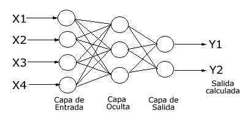
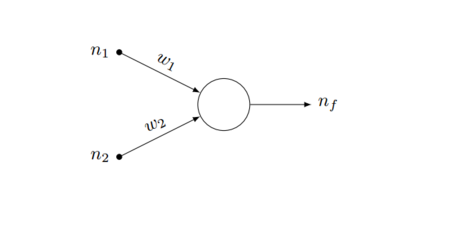
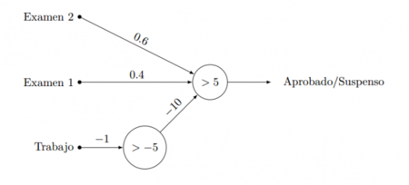

# TRABAJO TEÓRICO

## 1. INTRODUCCIÓN

La comprensión del concepto de Representación del Conocimiento (RC a partir de ahora) es más entendible si es abordada en términos de los cinco posibles roles que desempeña.  Estos roles se resumen de la siguiente forma:
1.	Rol 1: Una RC es un sustituto, reemplazo de la cosa misma, utilizado para permitir a una entidad determinar consecuencias pensando en lugar de actuar.

2.	Rol 2: Una RC es un conjunto de decisiones sobre cómo y qué ver en el mundo. Es importante destacar que una RC no es una estructura de datos.

3.	Rol 3: Una RC es una Teoría Parcial del Razonamiento Inteligente, expresada en términos de 3 componentes:

	a.	La concepción fundamental de la representación del razonamiento inteligente.

	b.	El conjunto de inferencias que la representación establece.
	c.	Conjunto de inferencias que recomienda.

Existen diferentes definiciones para razonamiento inteligente desde distintos campos de estudio, como la matemática (variedad de cálculos formales, típicamente deducibles) o la psicología (comportamiento humano característico), entre otros muchos.

4.	Rol 4: Medio para computación pragmática eficiente, es decir, el entorno computacional en el que se realiza el pensamiento. Organiza la información para facilitar las inferencias.

5.	Rol 5: Medio de expresión humana, una lengua en la que decimos cosas sobre el mundo. 

Además, una buena RC cumple los siguientes puntos:

 •	Es comprensible por los humanos, soporta la modularidad y la jerarquía de clases. Por ejemplo: Los pastores alemanes son perros que, a su vez, son animales.

 •	Tiene consistencia. Un ejemplo de dos interpretaciones: 

	 o	Pablo ha encendido el ordenador.

	 o	El ordenador ha sido encendido por Pablo.

 •	Es eficiente.

 •	Es fácil de modificar y actualizar.

Para terminar de comprender qué es una RC, es necesario definir el término inferencia, pues toda RC lo emplea. Una inferencia es el proceso que lleva de unas premisas a una conclusión, la cual puede ser válida o no. Una oración es válida si y solo sí es verdadera en todos los casos posibles.

## 2. TÉCNICAS DE RC

Existen cinco técnicas para la Representación del Conocimiento:

 •	Representación Lógica

 •	Representación de Red Semántica

 •	Reglas de Producción

 •	Representación de Marcos

 •	Redes neuronales

Estás técnicas están apoyadas en lenguajes y estos constan de dos aspectos básicos:

 •	Sintaxis, que explica cómo es la forma en la que se construyen las oraciones, combinando estructuras más sencillas. Por ejemplo: en la oración _Marina puerta la abre_, se puede decir que es sintácticamente errónea porque sus elementos están mal ordenados.

 •	Semántica, que explica la correspondencia entre los elementos del lenguaje y su significado.

### 2.1 REPRESENTACIÓN LÓGICA

Técnica que permite llegar mediante el razonamiento a una conclusión, basándose en unas premisas dadas.
Este razonamiento puede ser deductivo, donde la conclusión contiene conocimiento que es deducido de forma inmediata de las premisas. Un ejemplo de razonamiento deductivo seria, si todos los humanos son mortales, y Jonny Depp es humano, por lo que podemos deducir que Jonny Depp es mortal.
 Por otra parte, el razonamiento también puede ser inductivo, que es la que se utiliza en esta representación, donde el conocimiento aportado por las premisas no se infiere directamente a la conclusión. Por ejemplo, si un pastor alemán y un bulldog ladran, podemos inferir que un husky siberiano ladra.
Si llegamos a una conclusión por reglas de elementos del mismo tipo, como en el ejemplo anterior, no siempre tiene por qué ser verdad, pero es verdadero con una cierta probabilidad por lo que llamaremos a estos como razonamientos probabilísticos o plausibles.

Dentro de la representación lógica tenemos distintas técnicas lógicas:

•	Lógica clásica, es aquella donde una conclusión es verdadera totalmente o falsa totalmente.

•	Lógicas no clásicas (lógica difusa), son aquellas en la que algo es cierto con un grado de probabilidad.

•	Lógica propositiva o lógica de enunciados, las cuales manejan preposiciones completas y podemos unirlas mediante conectores.

•	Lógica de predicados de primer orden, en las cuales manejamos objetos, predicados sobre los objetos, propiedades (dueño de, hijo de), cuantificadores (muchos, pocos, nada) y conectores.

•	Lógica de predicados de orden superior, es aquellos donde podemos hacer inferencias sobre la lógica.

•	Lógica multivaluadas, son aquellas en las que tratamos con varios valores de verdad, introduciendo el valor ½ para las proposiciones cuya verdad está por determinar, cómo las proposiciones futuras.

        

**VENTAJAS**

 •	 Facilidad de implementación

 •	 Similar al comportamiento humano

 •	 Forma rápida y económica de resolver problemas

**DESVENTAJAS**

 •	 Ante problemas que tiene solución mediante un modelo matemático, obtenemos peor resultado.

 •	 Existe muy pocas herramientas de depuración.

 •	 Es poco utilizado en problemas reales.

 •	 Dependiendo del problema, el motor de inferencia puede ser ineficiente. 

### 2.2 REPRESENTACIÓN DE RED SEMÁNTICA
Técnica que permite representar mediante un gráfico cómo se interrelacionan las palabras. Es una alternativa a la lógica de predicados.
La red está formada por nodos, representando los objetos, y arcos, representando la relación entre esos objetos. Además, esta representación permite crear categorías de los distintos objetos y relacionarlas de distintas maneras. 
Existen dos formas para presentar una red semántica:

-	Mediante un grafo: Conjunto de elementos denominados nodos o vértices que se conectan a través de enlaces conocidos como arcos o aristas. (Ilustración 1).

        

-	Mediante un árbol: red semántica que no presenta un ciclo.

**VENTAJAS**
-	Las redes semanticas son una representación natural del conocimiento.
-	Transmite significado de manera transparente.
-	Redes simples y fáciles de entender.

**DESVENTAJAS**
-	Conllevan un gran tiempo de ejecución, son de alto coste computacional.
-	No son inteligentes, dependen del creador del sistema.

### 2.3 REGLAS DE PRODUCCIÓN
Técnica que utiliza reglas del estilo Si-Entonces. Es bastante popular, ya que se ha conseguido construir varios sistemas expertos ya con ella. Una herramienta muy conocida que utiliza esta técnica es CLIPS.
Su estructura general se basa en: Antecedente -> Consecuente.
El antecedente contiene la clausula a cumplir para que se ejecute la regla, y el consecuente contiene la conclusión de la premisa o la acción a realizar.
Cuando se cumple un antecedente esa regla se ejecuta, pero para seleccionar una regla cuando hay varias disponibles, utiliza un método de resolución de conflicto.

**VENTAJAS**
-	Representan de forma natural el conocimiento explícito de los expertos.
-	Todas las relgas tienen la misma estructura.
-	Separación entre base de conocimiento y su procsamiento.
-	Capacidad para trabajar con conocimiento incompleto e incertidumbre.

**DESVENTAJAS**
-	Incapaz de aprender.
-	Estrategias de búsquedas muy ineficientes.
-	Con un gran número de reglas, es difícil saber qué papel toma una de ellas en concreto.

### 2.4 REPRESENTACIÓN DE MARCOS
Esta representación se basa en la conducta humana de intentar resolver situaciones nuevas relacionándola con otras anteriores. Por ejemplo, cuando vamos a entrar en un piso nuevo, nos esperamos ver una cocina, un salón un baño, etc.

Al igual que las redes semánticas, podemos entender los marcos como una red de nodos, los cuales están compuesto por atributos y valores. La diferencia entre las redes semánticas y los marcos es que estos últimos se ordenan mediante herencia. Esto es lo que dio pie al concepto que conocemos como orientación a objetos.

Los marcos funcionan procesando la información recibida activando algunos marcos relacionados con esta información, y estos marcos a su vez activa a otros. Esto es denominado reconocimiento descendente y tiene el objetivo de predecir y explicar la información que se va a encontrar en la situación.

        

### 2.5 REDES NEURONALES
Este método de RC se explicará en profundidad en el apartado siguiente.

## 3. EN DETALLE: REDES NEURONALES
Las Redes Neuronales conforman un campo muy importante dentro de la Inteligencia Artificial. Este modelo se inspira en el comportamiento conocido del cerebro humano (en lo referente a las neuronas y sus conexiones) y trata de crear modelos artificiales que solucionen problemas difíciles de resolver mediante técnicas algorítmicas convencionales.

El objetivo es obtener información útil para la toma de decisiones. Una red neuronal simula el modo en el que el cerebro humano procesa la información.

### 3.1 FUNCIONAMIENTO

Inspiradas en el sistema nervioso y el comportamiento biológico, las redes neuronales crean un sistema de interconexión en capas de neuronas artificiales que colaboran para procesar datos de entrada y generar salidas.

Al ser un modelo computacional, las Redes Neuronales Artificiales (RNA) utilizan elementos de proceso (EP o nodos, que simulan las neuronas) y enlaces (simulan las conexiones entre neuronas). Los nodos y conexiones de la RNA se organizan en capas.

        

Con la experiencia, o repetición de sucesos, las neuronas van creando y reforzando ciertas conexiones, con el objetivo de aprender y hacer que algo se quede fijo.

A pesar del enfoque biológico, las RNA han terminado siendo un conjunto de elementos matemáticos y estadísticos. Se basan en una idea sencilla: dados unos parámetros hay una forma de combinarlos para predecir un cierto resultado. 

Las redes neuronales son un modelo para encontrar esa combinación de parámetros y aplicarla al mismo tiempo. Encontrar la mejor combinación de parámetros se denomina “entrenamiento de la red”, y da lugar al proceso de aprendizaje.

Una red entrenada es usada luego para realizar predicciones o clasificaciones. Es capaz de hacerlo mediante la aplicación de los parámetros correctos.

### 3.2 UTILIDADES

Las RNA tienen capacidad de aprender de forma automática, proceso conocido como machine learning.

Algunas de las RNA son:

-	Sistemas Inteligentes para la toma de decisiones en la gestión empresarial.
-	Predicción.
-	Reconocimiento de tendencias.
-	Reconocimiento de patrones y gestión de riesgo, aplicados por ejemplo a la detección de fraude.
-	Artefactos inteligentes con capacidad de aprendizaje, por ejemplo, los altavoces inteligentes.
-	Hogar inteligente o domótica.
-	Sistemas de visión computacional y detección.
-	Vehículos autónomos y energías renovables.

### 3.2 UTILIDADES

Para un mejor entendimiento del funcionamiento de las RNA, se va a desarrollar el siguiente
ejemplo.

_Somos 6 alumnos de una clase en la que el profesor no ha dicho exactamente cómo va a poner
las notas. Sólo hemos hecho dos exámenes y tenemos la nota de cada uno de ellos y la final._

        

_Siguiendo la ilustración 5, asignamos a las entradas (n1 y n2) las notas, cada una con su
correspondiente peso (w1, w2, elementos no definidos). La salida, nf, será 1 si un alumno está
aprobado y 0 si no lo está._

Para saber el valor de cada examen, tan solo hace falta recurrir al elemento fundamental de una
RNA: el perceptrón (EP). Tiene varias entradas, con un peso cada una. Si la suma de esas entradas
por cada peso es mayor que un determinado número (5, que es la nota del aprobado), la salida
del perceptrón es uno. En caso contrario, la salida es cero.

Los pesos no están definidos en el ejemplo, por lo que es lo que tenemos que encargarnos de
identificar mediante el entrenamiento. Se comenzará con una asignación aleatoria de valores a
esos pesos, 0.5 y 0.5, el mismo peso a cada examen, y ver qué resultado da la red neuronal para
cada alumno. Si falla en algún caso, hay que reajustar los parámetros. Así hasta que nadie falle.

La idea del ajuste o retroalimentación es ir adaptando la red a la información “oculta” que tienen
los datos que pasamos para que aprenda.

_Se da una situación curiosa: dos alumnos que tienen la misma nota en los exámenes, dos dices,
pero uno tiene un 7 en el trabajo y otro un 4. El del 7 ha aprobado el curso, pero el del 4 no. Hay
otro alumno que tiene un 10 en el trabajo y 4.99 en los dos exámenes y que está suspenso._

Para resolver esta ampliación del caso anterior, es necesario tener capas. Se necesita un
perceptrón intermedio que diga si el trabajo está aprobado o no, y contar eso en el perceptrón
de salida. Una posibilidad sería como la red de la ilustración siguiente:

### 3.4 REDES MULTICAPA

El ejemplo anterior es tan simple que con un solo perceptrón puede resolverse. Sin embargo, en
otros tipos de problemas, se requieren redes neuronales mucho más eficientes y elaboradas.
Para ello, se crean las capas. Siguiendo con el ejemplo anterior:

        

Con esto se ha logrado añadir información que no estaba antes. En función del problema
estudiado, pueden incluirse todas las capas que sean necesarias, y conectar los perceptrones
según convenga.

La mayor ventaja viene cuando, durante el proceso de aprendizaje, cada capa aprende a
encontrar y detectar las características que mejor ayudan a clasificar los datos. La idea es que
con más capas con más neuronas cada una se puedan mejorar las predicciones en conjuntos de
datos más complicados.

## BIBLIOGRAFÍA

[1] https://www.nebrija.es/~cmalagon/ia/transparencias/representacion_del_conocimiento_prolog.pdf

[2] https://es.wikipedia.org/wiki/Representaci%C3%B3n_del_conocimiento

[3] http://www.cs.us.es/~fsancho/?e=103

[4] https://itziasite.wordpress.com/redes-de-marcos/

[5] http://www.uco.es/grupos/eatco/informatica/ia/tema1.pdf

[6] https://www.cs.us.es/cursos/ia2-2003/temas/tema-03.pdf

[7] https://github.com/pablopcr/TeoriaRC/blob/master/TrabajoTeorico/documentacion/1029-Article%20Text-1026-1-10-20080129.pdf

[8] https://www.xataka.com/robotica-e-ia/las-redes-neuronales-que-son-y-por-queestan-volviendo

[9] http://avellano.fis.usal.es/~lalonso/RNA/index.htm

[10] https://empresas.blogthinkbig.com/redes-neuronales-artificiales/
